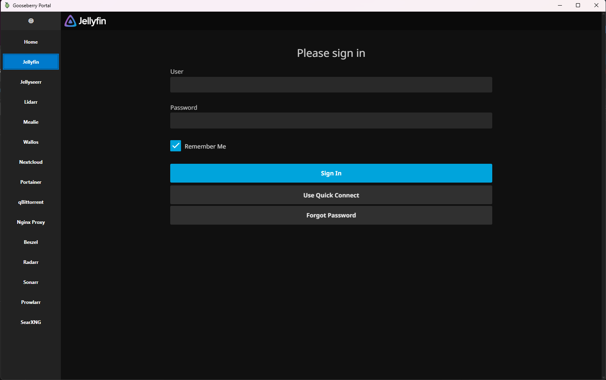
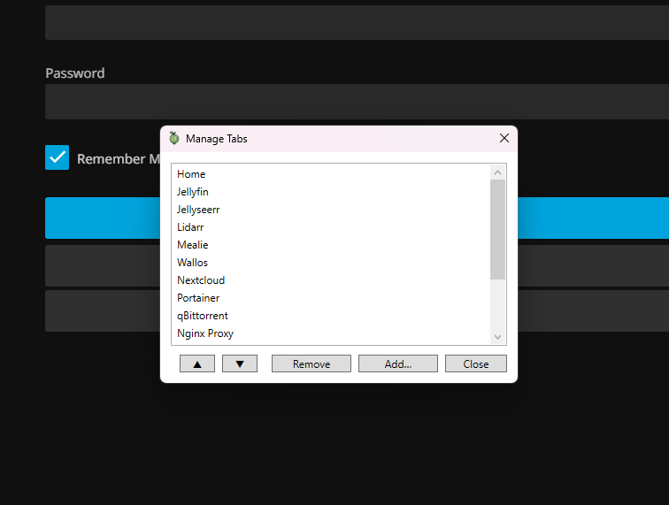
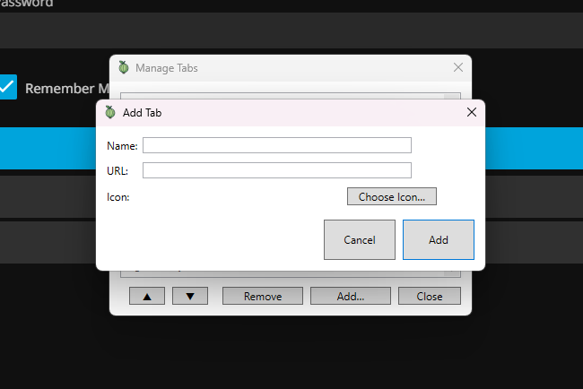

  

<h1 align="center">Gooseberry Portal</h1>

A super simple WPF desktop app for managing a list of quick-access pages or tools - built because I wanted something lightweight, fast, and focused for my home server setup.

---

## ✨ Features

- ✅ Add, remove, and edit custom "pages" (Web-views)
- ✅ Quick-launch interface
- ✅ Persistent storage (your pages are saved)
- ✅ Minimalist UI with dark styling
- ✅ Packaged as a standalone `.msix` installer

---

## 🧠 Why?

I wanted something like this for my own use - nothing overengineered, just a way to launch the tools and pages I use every day without clutter.

Since it only took an afternoon to make, I figured I'd share it in case it's useful to anyone else.

I might come back to this and improve on it somehow - Let me know if you have any suggestions.

---

## 🧩 How to Install Gooseberry Portal

You can download Gooseberry Portal from the [Releases](https://github.com/HabiRabbu/GooseberryPortal/releases) page.

### 🔸 If the app installs without issues:

You're all set! Just download the `.msix` file and open it to install.

### 🔸 If Windows blocks the install:

Because the app isn't signed with a trusted certificate (yet), you may need to manually trust it.

#### Steps:

1. Download both files from the [Releases](https://github.com/HabiRabbu/GooseberryPortal/releases) page:
   - `GooseberryPortal_1.0.0.0_x64.msix`
   - `GooseberryPortal_1.0.0.0_x64.cer`

2. **Install the certificate**:
   - Double-click `GooseberryPortal.cer`
   - Choose **Local Machine**
   - Select **Place all certificates in the following store**
   - Choose **Trusted People**
   - Complete the wizard

3. Run `GooseberryPortal.msix` again — it should now install without issues.

### 💡 Still not working?

You can also enable Developer Mode:

- Go to **Settings > Privacy & Security > For Developers**
- Toggle **Developer Mode** ON

Then try running the `.msix` file again.

Let me know if you run into any issues!

---

## 📌 Notes

- This is a first version - very basic by design
- I'm happy to keep it simple, but if you'd like to see it improved, open an issue or suggest a feature
- Could be fun to keep iterating on it 🙂

---

## 🛠 Tech Stack

- C#
- .NET 8
- WPF

---

## 💬 Feedback Welcome

Got ideas? Suggestions? Want it themed differently or extended with new features?  
Open an issue - Might be fun.
